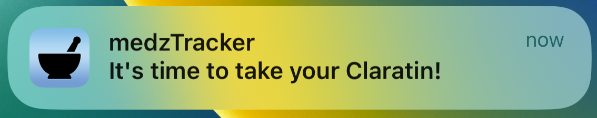
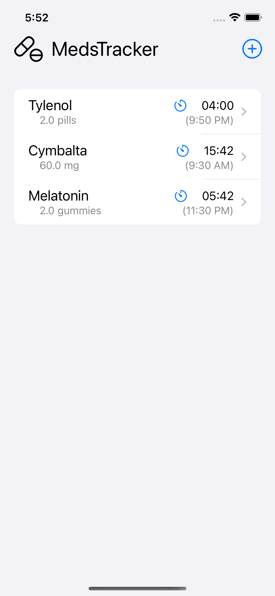
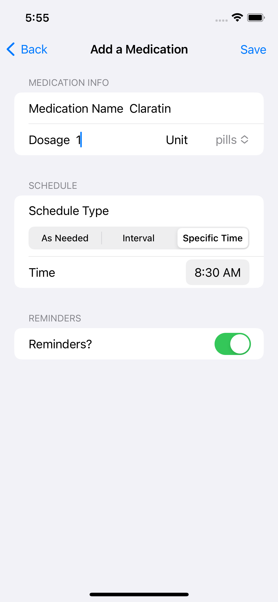
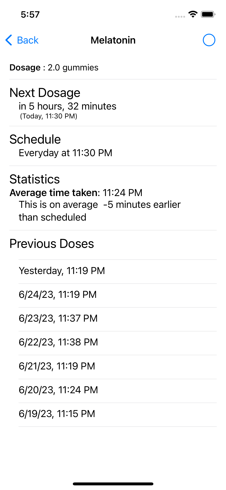

#  medzTracker

iOS Medication Tracker app built using SwiftUI.

- Can keep Track of medication taking at a certain time each day, or at an interval
- Sends notifications using Local Notifications when it is time to take medication
- Displays analytics about what time you usually take your medication

<table width="100%">
    <tr>
        <td width="25%">  Main Screen</td>
        <td width="25%">  Add Medication Screen</td>
        <td width="25%"> Details Screen</td>
    </tr>

</table>

